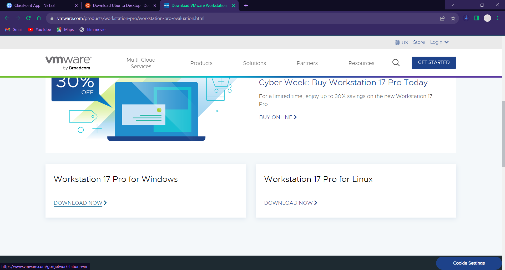
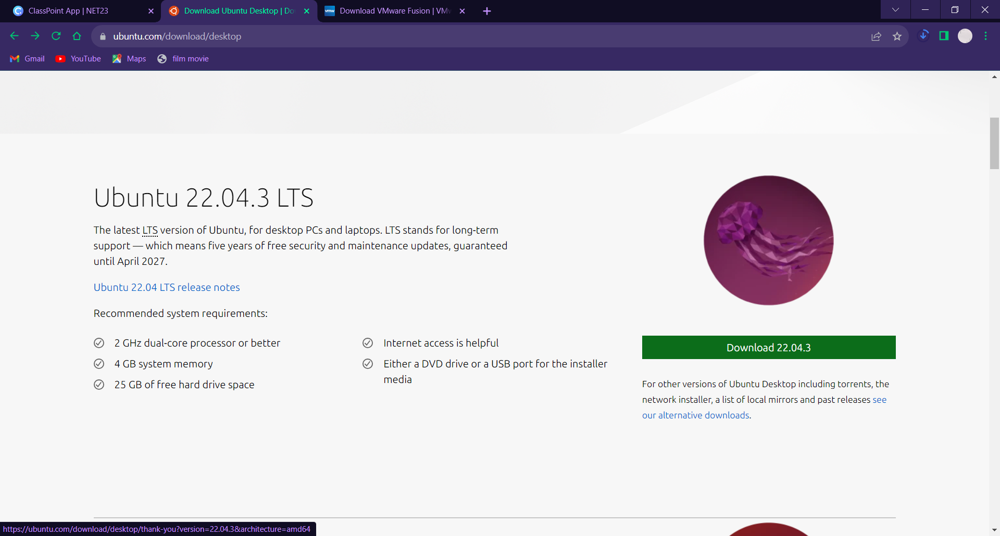
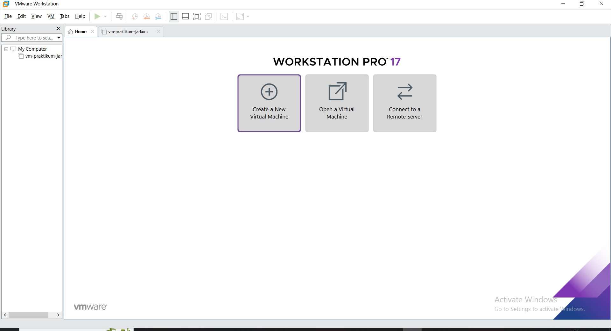
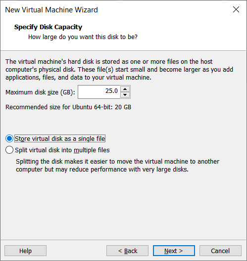
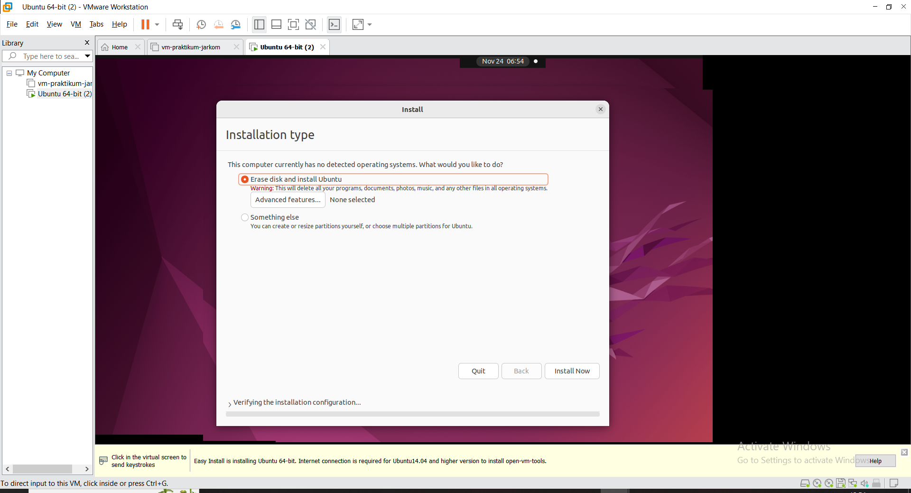

# Prerequisites

## Table of Contents

1. [Instalasi VMware](#instalasi-vmware)
2. [Download Ubuntu ISO](#download-ubuntu-iso)
3. [Instalasi Ubuntu](#instalasi-ubuntu)

## Instalasi VMware

1. Masuk ke link berikut: https://www.vmware.com/products/workstation-pro/workstation-pro-evaluation.html

2. Lalu klik bagian download for windows: 

    

3. Tunggu proses download hingga selesai

4. Lakukan proses instalasi sesuai dengan petunjuk

## Download Ubuntu ISO

1. Kunjungi website ubuntu berikut: https://ubuntu.com/download/desktop

2. Klik download untuk Ubuntu versi 22.04.3 (Jammy)

    

3. Tunggu proses download hingga selesai

## Instalasi Ubuntu

1. Buka aplikasi virtual machine dan pilih create new vm

2. Pilih **Typical**
3. Untuk Guest Operating System, pilih installer disc image file (ISO), klik browse

4. Pada personalization, masukkan:
- full name:  ubuntu
- username: ubuntu
- password: root
- confirm: root

5. Masukkan storage denagn ukuran 25GB, dan store as a single file

6. Klik Finish

7. Buka VM Ubuntu yang telah kita buat, lalu tunggu hingga booting selesai

8. Lalu pilih bahasa inggris

9. Lalu pilih normal installation

10. Klik Install now dan continue

11. Masukkan ubuntu sebagai your name dan username, lalu masukkan root sebagai password

12. Tunggu proses instalasi hingga selesai

13. Kalau sudah klik restart now, lalu login dengan kredensial:
- username: ubuntu
- password: root