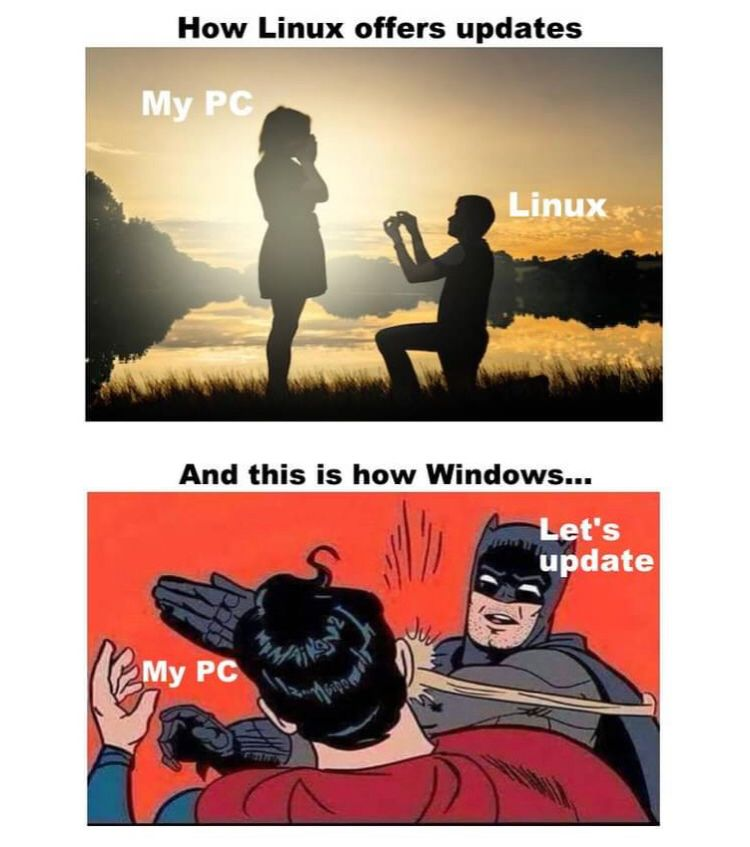
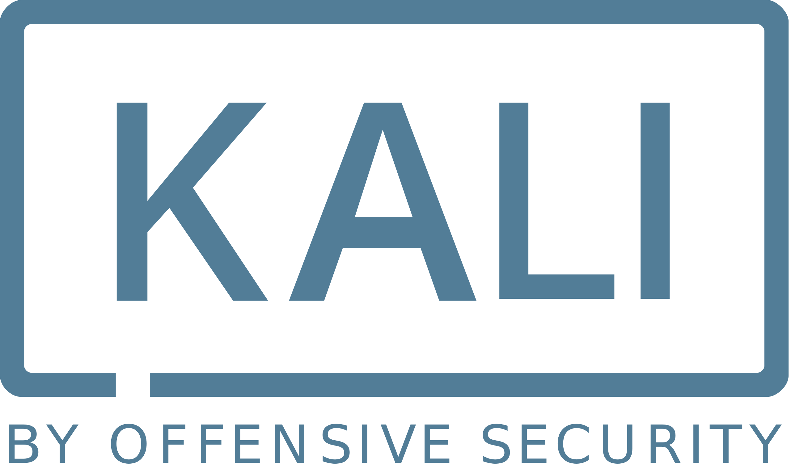
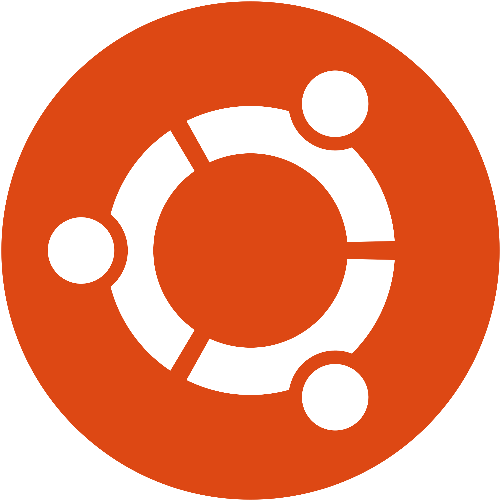
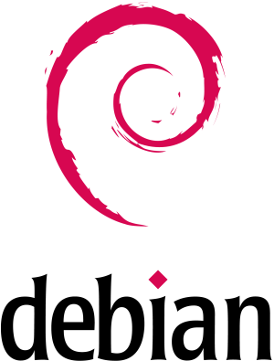

# What is Linux?

## Table of Contents

1. [Sistem Operasi](#apa-itu-sistem-operasi)
2. [Komparasi Linux dan OS Lain](#perbedaan-linux-dan-os-lainnya)
3. [Distro Linux](#distro-linux)

## Apa Itu Sistem Operasi?

Sistem operasi (OS) adalah perangkat lunak yang bertindak sebagai perantara antara perangkat keras komputer dan pengguna. Mengelola perangkat keras komputer dan menyediakan layanan penting untuk berbagai aplikasi. Menjadi jembatan bagi pengguna untuk berinteraksi dengan komputer dan komponennya.

### Fungsi Utama Sistem Operasi

- Pengelola Sumber Daya

- Manajemen Proses

- Manajemen Memori

- Manajemen File System

- User Interface

## Perbedaan Linux dan OS Lainnya

### Apa sih Linux ?!?!?

  

  

Linux adalah nama yang diberikan kepada sistem operasi bertipe Unix. Linux merupakan salah satu contoh hasil pengembangan perangkat lunak bebas dan sumber terbuka utama (<i>open source</i>). Seperti perangkat lunak bebas dan sumber terbuka lainnya pada umumnya, kode sumber Linux dapat dimodifikasi, digunakan dan didistribusikan kembali secara bebas oleh siapa saja. Dengan kata lain, kalian pun juga bisa berkontribusi untuk mengembangkan linux menjadi sistem operasi yang lebih baik kedepannya.

### Apa bedanya dengan Windows OS dan macOS ?

| Fitur              | Linux                                    | Windows                                     | macOS                                           |
|--------------------|------------------------------------------|----------------------------------------------|-------------------------------------------------|
| **Antarmuka Pengguna** | Fleksibel, bisa dimodifikasi sesuka hati | Antarmuka GUI konsisten di berbagai versi; Menu Start, Taskbar | GUI yang seragam dan intuitif; Dock, Menu Bar |
| **Biaya**          | Sebagian besar gratis | Biaya lisensi untuk sebagian besar versi; pembaruan gratis | Produk komersial dengan biaya untuk perangkat keras |
| **Perangkat Lunak** | Repositori perangkat lunak sumber terbuka yang luas dengan dukungan bervariasi | Dukungan perangkat lunak yang luas dan terkontrol | Dukungan perangkat lunak yang kuat; Mac App Store |
| **Kustomisasi**    | Sangat dapat disesuaikan; berbagai distribusi memenuhi berbagai kebutuhan | Kustomisasi terbatas; sebagian besar dikendalikan oleh Microsoft | Kustomisasi terbatas dibandingkan dengan Linux |
| **Keamanan**       | Umumnya kurang rentan terhadap malware; pembaruan teratur tersedia | Rentan terhadap malware; pembaruan keamanan teratur | Umumnya aman; lebih sedikit ancaman malware |
| **Kompatibilitas** | Kompatibilitas bervariasi berdasarkan dukungan perangkat lunak dan versi | Kompatibilitas perangkat lunak dan perangkat keras yang luas | Pilihan perangkat keras terbatas; dukungan perangkat lunak baik |
| **Dukungan Perangkat Keras** | Mendukung berbagai konfigurasi perangkat keras | Sangat kompatibel dengan berbagai perangkat keras | Terbatas pada perangkat keras produksi Apple; tidak terlalu fleksibel |
| **Terminal/Baris Perintah** | Menekankan antarmuka baris perintah | Command Prompt dan PowerShell tersedia | Mendukung antarmuka baris perintah berbasis Unix |

### Pros and Cons

| **Kelebihan Linux (Pros)**                                     | **Kelemahan Linux (Cons)**                                        |
|-----------------------------------------------------------------|--------------------------------------------------------------------|
| Sumber Terbuka (Open Source) yang mendukung inovasi dan kebebasan pengguna | Kompatibilitas perangkat lunak terbatas                            |
| Keamanan yang kuat, kurang rentan terhadap malware dan virus      | Dukungan perangkat keras masih terbatas                            |
| Stabilitas, kinerja handal, dan jarang memerlukan rebooting        | Kurva pembelajaran curam untuk pengguna baru yang tidak terbiasa menggunakan Unix type                       |
| Berbagai distribusi untuk berbagai keperluan pengguna (distro)             | Dukungan komersial terbatas                                       |
| Kustomisasi tinggi, pengguna memiliki kontrol penuh atas sistem    | Keterbatasan aplikasi dan permainan (contoh: valorant)   |

<!-- 

    

 -->

## Distro Linux

Linux memiliki banyak distribusi atau seringkali disebut dengan distro. Distro pada linux memiliki kelebihan bidang spesifik untuk kebutuhan memenuhi kebutuhan para user. Trus apa aja contoh dan keuntungan dari distro linux yang tersedia saat ini?

| Logo          | Distribusi    | Penggunaan                              | Kelebihan                               | Deskripsi                                                                                                                         | Parent Distributions                         |
|---------------|---------------|-----------------------------------------|-----------------------------------------|------------------------------------------------------------------------------------------------------------------------------------|----------------------------------------------|
|     | Kali Linux    | Pengujian penetrasi dan ethical hacking  | Beragam alat untuk pengujian keamanan   | Kali Linux adalah distribusi Linux khusus yang dirancang untuk pengujian penetrasi, ethical hacking, dan forensik digital. Dilengkapi dengan beragam alat keamanan, menjadikannya pilihan penting bagi profesional keamanan cyber dan penggemar. Distribusi ini ditujukan untuk pengguna yang mahir dan memerlukan alat kuat untuk menguji dan mengamankan jaringan serta sistem. | Debian                                     |
|  | Red Hat       | Server enterprise dan penggunaan korporat| Stabil, andal, dan dukungan yang kuat   | Red Hat adalah distribusi Linux yang banyak digunakan dalam lingkungan perusahaan dan pengaturan korporat untuk implementasi server. Dikenal karena stabilitas, keandalan, dan dukungan kuat, Red Hat menyediakan sistem operasi berkelas enterprise dengan dukungan jangka panjang, menjadikannya pilihan utama untuk bisnis dan organisasi yang memerlukan solusi server yang tangguh.              | Fedora, CentOS                              |
| | Manjaro       | Penggunaan desktop dan model rilis bergulir| Ramah pengguna, perangkat lunak terkini | Manjaro adalah distribusi Linux yang ramah pengguna berbasis Arch Linux, dikenal karena kesederhanaan dan model rilis bergulir. Dirancang untuk pengguna desktop yang menginginkan pengalaman ramah pengguna sambil tetap memiliki akses ke perangkat lunak terkini. Manjaro menggabungkan keuntungan Arch Linux dengan penekanan pada aksesibilitas dan kemudahan penggunaan, menjadikannya pilihan menarik bagi mereka yang menginginkan keseimbangan antara perangkat lunak terkini dan desain ramah pengguna.                   | Arch Linux                                  |
|  | Linux Mint    | Penggunaan desktop, pemula, dan multimedia| Ramah pengguna, stabil, pusat perangkat lunak | Linux Mint adalah distribusi Linux desktop populer, terutama disukai oleh pengguna baru dalam ekosistem Linux. Dikenal karena antarmuka yang ramah pengguna, stabilitas, dan inklusi codec multimedia out-of-the-box, Linux Mint memberikan pengalaman desktop yang mulus. Fitur pusat perangkat lunak untuk pengelolaan aplikasi yang mudah dan menekankan kesederhanaan, menjadikannya pilihan yang sangat baik bagi mereka yang bertransisi dari sistem operasi lain.                 | Ubuntu                                      |
|    | Ubuntu        | Desktop, server, cloud, dan IoT         | Komunitas besar, repositori luas        | Ubuntu adalah distribusi Linux serbaguna yang cocok untuk desktop, server, komputasi awan, dan perangkat Internet of Things (IoT). Dengan komunitas besar dan aktif, Ubuntu menawarkan repositori perangkat lunak yang luas dan rilis LTS (Long Term Support) untuk stabilitas. Sifatnya yang ramah pengguna dan kompatibilitas menjadikannya pilihan populer bagi berbagai pengguna, dari pemula hingga pengembang dan administrator sistem yang berpengalaman.                        | Debian                                     |
|    | Debian        | Berbagai penggunaan                     | Stabil, fleksibel, dan komunitas besar   | Debian adalah distribusi Linux universal yang dapat digunakan untuk berbagai tujuan. Dikenal karena stabilitas, fleksibilitas, dan dukungan dari komunitas besar. Debian sering menjadi dasar untuk distribusi lain, seperti Ubuntu. Distribusi ini mengutamakan perangkat lunak yang telah diuji dengan baik dan dukungan yang berkelanjutan, menjadikannya pilihan populer bagi pengguna yang mencari keandalan dan fleksibilitas.                   | -                                          |

