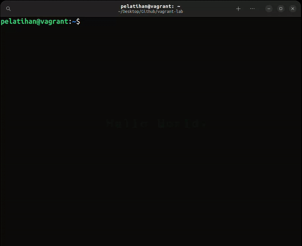

# Filesystem and Ownership

## Table of Contents

1. [Interaksi Filesystem](#interaksi-filesystem)
2. [Struktur Direktori](#struktur-direktori)
3. [Manajemen User dan Group](#manajemen-user-dan-group)

## Interaksi Filesystem

Linux Filesystem secara singkat adalah kumpulan terstruktur dari file-file pada partisi. Partisi adalah segmen dari media penyimpanan dan berisi data-data tertentu.

Linux filesystem biasanya terdiri dari:

- Root directory (/)
- Format dari storage at(EXT3, EXT4, BTRFS, XFS dan lain-lain)
- Format filesystem.

### Struktur Filesystem

Sistem berkas Linux memiliki struktur berkas hierarkis yang terdiri dari direktori utama (root directory) dan subdirektori-subdirektori di bawahnya. Semua direktori lain dapat diakses dari direktori utama. Biasanya, satu partisi hanya memiliki satu sistem berkas, tetapi dapat juga memiliki lebih dari satu sistem berkas.

Sistem berkas dirancang untuk mengelola dan menyediakan ruang untuk data penyimpanan non-volatile. Semua sistem berkas memerlukan namespace, yaitu metodologi penamaan dan pengorganisasian. Namespace menentukan proses penamaan, panjang nama file, atau subset karakter yang dapat digunakan untuk nama file. Namespace juga menentukan struktur logis file pada segmen memori, seperti penggunaan direktori untuk mengatur file tertentu.

### Tipe Filesystem

Saat kita menginstal sistem operasi Linux, Linux menawarkan banyak file system seperti `Ext, Ext2, Ext3, Ext4, JFS, ReiserFS, XFS, btrfs, dan swap`.

1. Ext, Ext2, Ext3 dan Ext4 file system
Filesystem Ext adalah singkatan dari Extended File System. Saat ini digunakan untuk pengembangan [MINIX OS](https://www.minix3.org). Filesystem Ext adalah versi lama, dan jarang digunakan karena beberapa keterbatasan.

    - `Ext2` - adalah Linux Filesystem pertama, yang memungkinkan pengolahan data hingga dua terabyte. Contoh sistem operasi yang menggunakan `Ext2` : NAS (Network Attached Storage) berbasis Linux, Android 4.3, embedded system, dan lain-lain.

       - Kelebihan:

         `Kompatibilitas` - Filesystem ext2 sudah lama digunakan dan didukung oleh banyak sistem operasi.

         `Performa` - Filesystem ext2 umumnya memiliki performa yang baik, terutama untuk sistem operasi dengan persyaratan performa yang rendah.

         `Ukuran` - Filesystem ext2 memiliki ukuran yang relatif kecil, sehingga cocok untuk perangkat dengan kapasitas penyimpanan yang terbatas.

       - Kelemahan:

         `Keamanan` - Filesystem ext2 tidak memiliki mekanisme journaling, sehingga lebih rentan terhadap kerusakan data.

         `Kapasitas` -  Filesystem ext2 memiliki kapasitas maksimum partisi sebesar 2 TB.

    - `Ext3` - adalah versi Ext2 yang ditingkatkan dan berisi kompatibilitas ke belakang. Filesystem ini diperkenalkan pada tahun 2001 dan menjadi file system default untuk banyak distribusi Linux selama beberapa tahun. ontoh sistem operasi yang menggunakan `Ext2` : NAS (Network Attached Storage) berbasis Linux, Android 4.4, embedded system, dan lain-lain.

        - Kelebihan:

          `Jurnalisasi`-  Fitur jurnalisasi ext3 membuat file system ini lebih tahan terhadap kerusakan data jika terjadi crash sistem.

        - Kekurangan:

          `Recovery` - Tidak mendukung server file system file ini tidak mendukung file recovery dan snapshot.

    - `Ext4` - Merupakan file system yang lebih cepat diantara semua file system, merupakan file system default disetiap distirbusi Linux. Contoh sistem operasi yang menggunakan `Ext4` : Debian, Ubuntu, SUSE, dan lain-lain.

    - Kelebihan:

        `Performa yang baik` - Ext4 umumnya menawarkan performa yang baik, terutama untuk file system yang besar.

        `Dukungan file besar` - Ext4 mendukung file hingga ukuran 1 EB (1.073.741.824.000.000.000 byte)

        `Jurnalisasi` - Fitur jurnalisasi ext4 membuat file system ini lebih tahan terhadap kerusakan data jika terjadi crash sistem.

    - Kekurangan:

        `Support` - Tidak mendukung volume management, data deduplication, dan lain-lain.

2. JFS File System
`JFS` adalah singkatan dari `Journaled File System`, dan dikembangkan oleh `IBM` untuk AIX Unix. Ini adalah alternatif untuk file system Ext. Ini juga dapat digunakan sebagai pengganti Ext4, yang memerlukan stabilitas dengan sedikit sumber daya. Ini adalah file system yang berguna ketika daya CPU terbatas. Contoh penggunaan JFS:

    - `Sistem operasi desktop dan server` - JFS digunakan sebagai sistem file default untuk sistem operasi desktop dan server Linux, seperti Ubuntu, Fedora, dan CentOS. Sistem operasi-sistem operasi ini menggunakan JFS untuk performa, kompatibilitas, dan fitur yang ditawarkannya. Misalnya, sistem operasi Ubuntu menggunakan JFS untuk partisi root, partisi home, dan partisi swap.

    - `Sistem database` - JFS digunakan untuk sistem database, seperti MySQL dan PostgreSQL. Sistem-sistem database ini menggunakan JFS untuk performa dan ketahanan data yang ditawarkannya. Misalnya, sistem database MySQL menggunakan JFS untuk penyimpanan datanya.

    - Kelebihan:

      `Dukungan untuk snapshot` - Snapshot memungkinkan Anda untuk mengambil salinan sistem berkas pada saat tertentu. Fitur ini berguna untuk pencadangan dan pemulihan.

      `Skalabilitas yang baik` - JFS dapat menangani sistem berkas yang sangat besar dengan baik.

    - Kekurangan:

      `Requirements` - FS memiliki persyaratan perangkat keras yang lebih tinggi daripada sistem berkas lainnya.

      `Kompleksitas` - JFS adalah sistem berkas yang kompleks, yang dapat membuatnya lebih sulit untuk dimaintenance.

3. ReiserFS File System
ReiserFS adalah alternatif dari file system Ext3. Dikembangkan pada tahun 2001 oleh Hans Reiser dan timnya di `Namesys`. Contoh sistem operasi yang menggunakan ReiserFS: SUSE Linux Enterprise dan Mandrake Linux.

    - Kelebihan:

      `Jurnalisasi` - ReiserFS memiliki log yang merekam semua perubahan pada sistem berkas. Fitur ini membuat ReiserFS lebih tahan terhadap kerusakan data jika terjadi crash sistem.

      `Performa yang baik` -  ReiserFS umumnya menawarkan performa yang baik, terutama untuk sistem berkas yang besar.

    - Kekurangan:

      `Keamanan` - ReiserFS pernah mengalami beberapa kerentanan keamanan, yang menyebabkan sistem berkas dapat dirusak atau dihapus.

      `Kompleksitas` - ReiserFS adalah sistem berkas yang kompleks, yang dapat membuatnya lebih sulit untuk dimaintenance.

4. XFS File System
XFS file system adalah versi ReiserFS yang ditingkatkan. XFS dikembangkan untuk pemrosesan I/O paralel. NASA masih menggunakan file system ini dengan server penyimpanannya yang tinggi (server 300+ Terabyte).  Dikembangkan oleh Silicon Graphics, Inc (SGI) untuk sistem operasi Unix dan Linux.

    - Kelebihan:

      `Dukungan file besar` - XFS mendukung file hingga ukuran 8 exabyte.

      `Kompatibilitas dengan Ext3` -  XFS kompatibel ke belakang dengan ext3, yang berarti partisi ext3 dapat dipasang dan dibaca oleh XFS tanpa masalah.

5. Btrfs File System
Btrfs adalah singkatan dari B tree file system. Dirancang untuk mengatasi keterbatasan sistem berkas lainnya, seperti Ext4 dan JFS. Btrfs masih dalam pengembangan, tetapi telah digunakan oleh beberapa distribusi Linux, seperti Fedora, Ubuntu, dan openSUSE. Btrfs juga digunakan oleh beberapa cloud provider, seperti Amazon Web Services dan Google Cloud Platform.

    - Kelebihan:

      `Copy-on-write (CoW)` -  Fitur CoW memungkinkan Btrfs untuk membuat salinan data lama sebelum menulis data baru, yang membantu mencegah kerusakan data.

      `Snapshotting` - Fitur snapshotting memungkinkan Btrfs untuk mengambil salinan sistem berkas pada saat tertentu, yang berguna untuk pencadangan dan pemulihan.

6. Swap File System
Swap file system adalah sistem berkas yang digunakan untuk menyimpan data sementara yang tidak sedang digunakan oleh memori utama (RAM). Swap file dapat digunakan untuk meningkatkan kinerja sistem operasi dengan memindahkan data yang tidak aktif ke disk, sehingga RAM dapat digunakan untuk data yang lebih aktif. Contoh Penggunaan:

    - `Pada sistem operasi server` - swap file dapat digunakan untuk meningkatkan kinerja aplikasi server yang membutuhkan banyak memori, seperti aplikasi web atau database.

    - `Pada sistem operasi embedded` -  swap file dapat digunakan untuk meningkatkan kinerja aplikasi yang berjalan di perangkat dengan RAM yang kecil.

    Kelebihan:

    - Dapat meningkatkan kinerja sistem operasi dengan memindahkan data yang tidak aktif ke disk.
    - Dapat digunakan untuk meningkatkan kinerja aplikasi yang menggunakan banyak memori.

    Kekurangan:

    - Membutuhkan ruang disk yang cukup besar.
    - Dapat memperlambat kinerja sistem operasi jika swap file sering digunakan

## Struktur Direktori

Jika kita ingin belajar Linux lebih mendalam, hal yang paling dasar untuk dipahami adalah struktur direktorinya. Struktur direktori pada Linux sangat berbeda dengan Windows. Berikut adalah perbandingan sturuktur direktori baik Windows maupun Linux.

### 1.1. Struktur direktori Windows

| **Directory** | **Deskripsi**|
|---------------|--------------|
|Program Files  |Berfungsi untuk menyimpan program-program dan aplikasi yang terinstal di dalam Windows.|
|Windows        | Menyimpan segala proses juga konten-konten utama windows. Akan terjadi kerudakan system jika ada kesalahan dalam mengatur folder ini. Isi dari folder ini berupa system32, Assembly, dan Web.|
|Temp           | Digunakan untuk menyimpan file-file sementara. |
|Document and Settings | Berfungsi untuk menyimpan dokumen dan pengaturan-pengaturan user mulai dari desktop, start menu, dsb.|

### 1.2. Struktur Direktori Linux

| **Directory**       | **Deskripsi** |
|---------------------|---------------|
| / (root filesystem) | Top-level directory, Partisi dimana diletakkan "/" (root system) akan menjadi direktori sistem atau partisi pokok. Hanya bisa diakses oleh user root atau super user.|
| /bin                | User binaries, memuat program arahan yang merupakan sebagian dari sistem operasi Linux. Direktori ini meng-handle perintah standar Linux, seperti cd, ls, cp, dll.|
| /etc                | Configuration files, direktori yang berisi file-file konfigurasi sistem. Selain itu, juga berisi file yang dijalankan ketika start up.|
| /sbin               | System binaries, memuat file administration yang dapat diakses seperti fdisk, shutdown, reboot, dll.|
| /usr                | User programs, direktori yang berisi file-file binary, libraries, dokumentasi, dan source code dari sistem.|
| /var                | Variable files, memuat berbagai file system seperti log, direktori mail, print dan lain – lain. Yang sering kali berubah kandungannya.|
| /dev                | Device files, direktori ini berisi file perangkat untuk setiap perangkat keras yang terpasang pada sistem. Ini bukan driver perangkat, melainkan file yang mewakili setiap perangkat di komputer dan memfasilitasi akses ke perangkat tersebut.|
| /home               | Home directories, ini home direktori untuk setiap user. Setiap user pasti memiliki subdirektori di `/home`.|
| /lib                | System libraries, memuat file-file library Linux yang mendukung binary files dalam direktori `/bin` dan `/sbin`.|
| /mnt                | Mount directory, direktori untuk mounting file sistem sementara (not removeable media).|
| /media              | Removable media devices, direktori untuk mounting removable media seperi drive CD-ROM, hardisk eksternal, flashdisk, zip drive, dll.|
| /opt                | Optional add-on applications, direktori ini menyimpan file-file tambahan dari vendor-vendor tertentu. Sifatnya hanya optional. Diharapkan dengan adanya direktori ini, manajemen paket aplikasi tambahan dapat dilakukan dengan mudah.|
| /boot               | Boot loader files, Direktori yang berisi file-file yang berhubungan dengan boot loader, contohnya Grub boot manager, File Kernel initrd, vmlinux, dll.|
| /tmp                | Temporary files, direktori yang digunakan untuk menyimpan data sementara. Isi dari direktori ini dibersihkan setiap kali sistem boot.|
| /root               |Ini bukan file system root (/). Ini adalah direktori home untuk user.|

### Explore Filesystem

Untuk menjelajahi filesystem, kita bisa menggunakan beberapa commands atau perintah:

#### 1. ls

`list`. Untuk menampilkan list atau daftar file-file apa saja yang ada disuatu directory. Parameter yang sering dipakai pada perintah ls adalah `-a`, `-l`, `-t`, `-h`, dan `-r`. Parameter digunakan untuk menentukan output yang kita inginkan. Parameter bisa digabungkan, dan urutan letak parameter tidak memengaruhi hasil.

#### 2. pwd

`print working directory`. Untuk mengetahui di directory mana kita berada sekarang.

#### 3. cd

`change directory`. Digunakan untuk pindah ke directory lain. Syntax-nya adalah `cd [namadirectory]`. Misalnya kita sedang berada di directory /home/pelatihan dan ingin berpindah ke directory `/usr/share`. Maka command yang kita gunakan adalah `cd /usr/share`.

Contoh lain:

- `cd` atau `cd ~` untuk pindah ke directory home user
- `cd /` untuk pindah ke directory root
- `cd ..` untuk pindah ke parent directory dari directory sekarang
- `cd -` untuk kembali ke working directory sebelumnya

## Manajemen User dan Group

### Referensi

- [Classic SysAdmin: The Linux Filesystem Explained by linuxfoundation.org](https://www.linuxfoundation.org/blog/blog/classic-sysadmin-the-linux-filesystem-explained)
- [An introduction to Linux filesystems by opensource.com](https://opensource.com/life/16/10/introduction-linux-filesystems)
- [Guide to Linux Filesystems by baeldung.com](https://www.baeldung.com/linux/filesystems)
- [Linux File System by javatpoint.com](https://www.javatpoint.com/linux-file-system)
