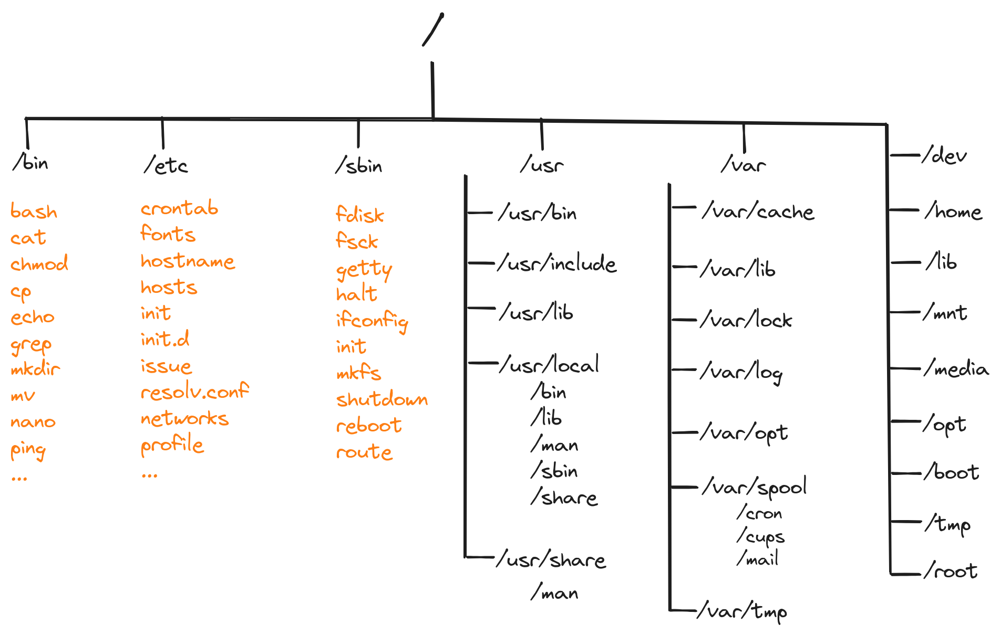

# Filesystem and Ownership

## Table of Contents

1. [Interaksi Filesystem](#interaksi-filesystem)
2. [Struktur Folder di Linux](#struktur-folder-di-linux)
3. [Manajemen User dan Group](#manajemen-user-dan-group)

## Interaksi Filesystem

Linux Filesystem secara singkat adalah kumpulan terstruktur dari file-file pada partisi. Partisi adalah segmen dari media penyimpanan dan berisi data-data tertentu.

Linux filesystem biasanya terdiri dari:

- Root directory (/)
- Format dari storage at(EXT3, EXT4, BTRFS, XFS dan lain-lain)
- Format filesystem.

### Struktur Filesystem

Sistem berkas Linux memiliki struktur berkas hierarkis yang terdiri dari direktori utama (root directory) dan subdirektori-subdirektori di bawahnya. Semua direktori lain dapat diakses dari direktori utama. Biasanya, satu partisi hanya memiliki satu sistem berkas, tetapi dapat juga memiliki lebih dari satu sistem berkas.

Sistem berkas dirancang untuk mengelola dan menyediakan ruang untuk data penyimpanan non-volatile. Semua sistem berkas memerlukan namespace, yaitu metodologi penamaan dan pengorganisasian. Namespace menentukan proses penamaan, panjang nama file, atau subset karakter yang dapat digunakan untuk nama file. Namespace juga menentukan struktur logis file pada segmen memori, seperti penggunaan direktori untuk mengatur file tertentu.

## Struktur Direktori

Jika kita ingin belajar Linux lebih mendalam, hal yang paling dasar untuk dipahami adalah struktur direktorinya. Struktur direktori pada Linux sangat berbeda dengan Windows. Berikut adalah perbandingan sturuktur direktori baik Windows maupun Linux.

### 1.1. Struktur direktori Windows

| **Directory** | **Deskripsi**|
|---------------|--------------|
|Program Files  |Berfungsi untuk menyimpan program-program dan aplikasi yang terinstal di dalam Windows.|
|Windows        | Menyimpan segala proses juga konten-konten utama windows. Akan terjadi kerudakan system jika ada kesalahan dalam mengatur folder ini. Isi dari folder ini berupa system32, Assembly, dan Web.|
|Temp           | Digunakan untuk menyimpan file-file sementara. |
|Document and Settings | Berfungsi untuk menyimpan dokumen dan pengaturan-pengaturan user mulai dari desktop, start menu, dsb.|

### 1.2. Struktur direktori Linux

| **Directory**       | **Deskripsi** |
|---------------------|---------------|
| / (root filesystem) | Top-level directory, Partisi dimana diletakkan "/" (root system) akan menjadi direktori sistem atau partisi pokok. Hanya bisa diakses oleh user root atau super user.|
| /bin                | User binaries, memuat program arahan yang merupakan sebagian dari sistem operasi Linux. Direktori ini meng-handle perintah standar Linux, seperti cd, ls, cp, dll.|
| /etc                | Configuration files, direktori yang berisi file-file konfigurasi sistem. Selain itu, juga berisi file yang dijalankan ketika start up.|
| /sbin               | System binaries, memuat file administration yang dapat diakses seperti fdisk, shutdown, reboot, dll.|
| /usr                | User programs, direktori yang berisi file-file binary, libraries, dokumentasi, dan source code dari sistem.|
| /var                | Variable files, memuat berbagai sistem file seperti log, direktori mail, print dan lain – lain. Yang sering kali berubah kandungannya.|
| /dev                | Device files, direktori ini berisi file perangkat untuk setiap perangkat keras yang terpasang pada sistem. Ini bukan driver perangkat, melainkan file yang mewakili setiap perangkat di komputer dan memfasilitasi akses ke perangkat tersebut.|
| /home               | Home directories, ini home direktori untuk setiap user. Setiap user pasti memiliki subdirektori di `/home`.|
| /lib                | System libraries, memuat file-file library Linux yang mendukung binary files dalam direktori `/bin` dan `/sbin`.|
| /mnt                | Mount directory, direktori untuk mounting file sistem sementara (not removeable media).|
| /media              | Removable media devices, direktori untuk mounting removable media seperi drive CD-ROM, hardisk eksternal, flashdisk, zip drive, dll.|
| /opt                | Optional add-on applications, direktori ini menyimpan file-file tambahan dari vendor-vendor tertentu. Sifatnya hanya optional. Diharapkan dengan adanya direktori ini, manajemen paket aplikasi tambahan dapat dilakukan dengan mudah.|
| /boot               | Boot loader files, Direktori yang berisi file-file yang berhubungan dengan boot loader, contohnya Grub boot manager, File Kernel initrd, vmlinux, dll.|
| /tmp                | Temporary files, direktori yang digunakan untuk menyimpan data sementara. Isi dari direktori ini dibersihkan setiap kali sistem boot.|
| /root               |Ini bukan sistem file root (/). Ini adalah direktori home untuk user.|

## Manajemen User dan Group
