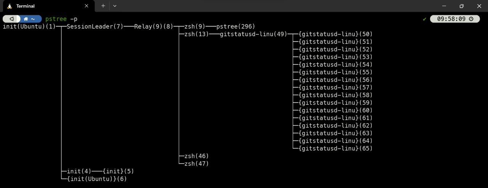
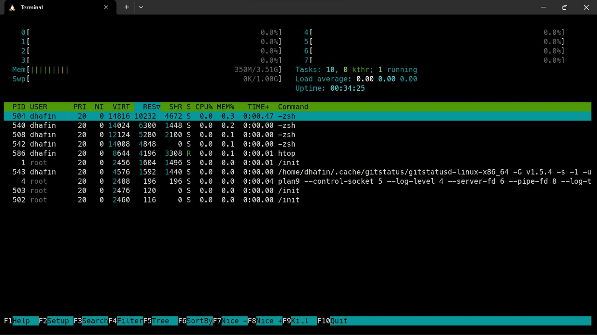
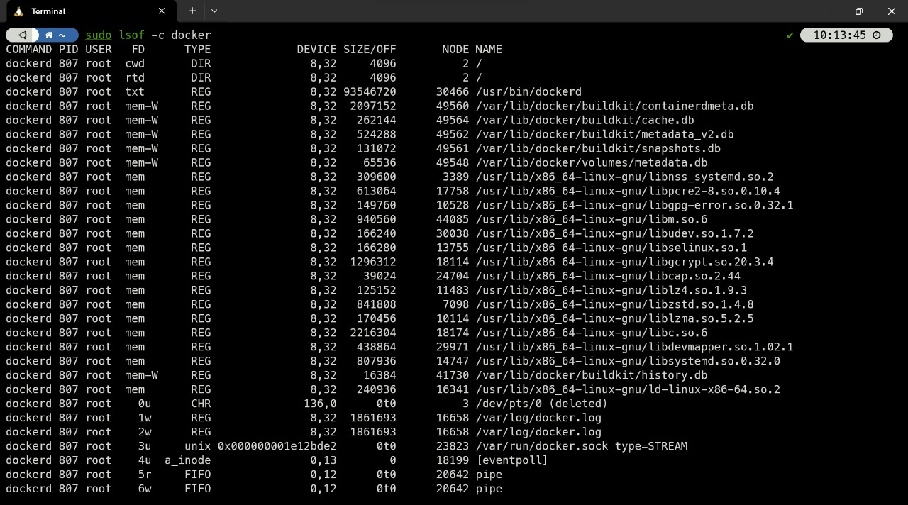
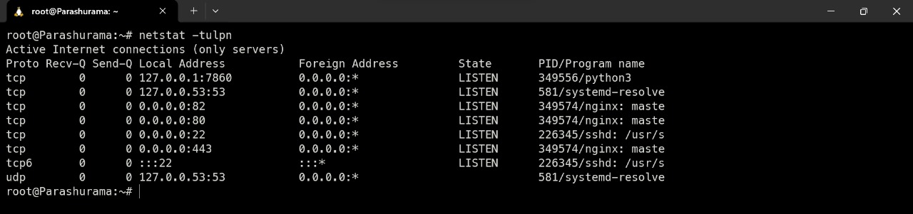
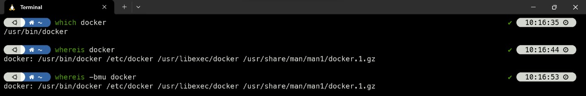

# Process and Monitoring

## Table of Contents

1. [Package dan Source Control](#package-dan-source-control)
2. [Process](#apa-itu-process)
3. [Foreground vs Background Process](#foreground-vs-background-process)
4. [Perintah Terkait Process](#perintah-terkait-process)

## Package dan Source Control

Pada masa-masa awal Linux, program hanya didistribusikan sebagai kode sumber, bersama dengan halaman manual yang diperlukan, file konfigurasi yang diperlukan, dan banyak lagi. Saat ini, sebagian besar distributor Linux menggunakan program bawaan atau kumpulan program yang disebut package, yang disajikan kepada pengguna yang siap untuk diinstal pada distribusi tersebut. Berikut beberapa kkonsep dalam package management yang perlu diketahui :

- Package

  package adalah suatu unit perangkat lunak yang telah dikemas bersama dengan informasi tambahan yang diperlukan untuk instalasi dan manajemen perangkat lunak tersebut. Contohnya adalah pacakge `.deb` jika di distro debian dan `.exe` jika pada windows. Package ini berisi file yang dibutuhkan oleh user untuk menjalankan suatu program. File yang dibutuhkan oleh user untuk menjalankan suatu program ini disebut dengan `binary file`. Binary file ini berisi kode program yang sudah dikompilasi. Kode program yang sudah dikompilasi ini akan dijalankan oleh kernel. Kernel adalah bagian dari sistem operasi yang bertugas untuk mengatur semua sumber daya yang ada pada komputer.

  perbedaan package pada linux dan windows adalah pada linux package yang diinstal akan disimpan pada path `/usr/bin` sedangkan pada windows package yang diinstal akan disimpan pada path `C:\Program Files`. Pada linux package yang diinstal akan disimpan pada path `/usr/bin` karena pada linux semua file yang dibutuhkan oleh user akan disimpan pada path `/usr/bin` sedangkan pada windows package yang diinstal akan disimpan pada path `C:\Program Files` karena pada windows semua file yang dibutuhkan oleh user akan disimpan pada path `C:\Program Files`.

- Package Manager

  Package manager adalah perangkat lunak yang dirancang untuk membantu pengguna mengelola instalasi, pembaruan, konfigurasi, dan penghapusan perangkat lunak pada sistem operasi. Package Manager dapat dikelompokkan menjadi 2 jenis yaitu `low-level` dan `high-level`. Seperti pada contoh dibawah ini :

  

  contohnya dpkg pada debian hanya bisa menginstal package .deb yang sudah tersedia pada host saja, sedangkan apt bisa menginstal package .deb dan juga bisa menginstal package dependensinya dari repository. Package manager yang berada diatas package manager lainnya disebut dengan high-level package manager. Package manager yang berada dibawah package manager lainnya disebut dengan low-level package manager.

- Repository

  Repositori adalah penyimpanan sentral tempat paket perangkat lunak disimpan dan dikelola. Repositori ini berisi berbagai perangkat lunak yang telah dikompilasi untuk digunakan pada distribusi Linux tertentu. Repository ini yang nantinya akan diakses oleh package manager untuk menginstal package yang dibutuhkan. List konfigurasi dapat dikonfigurasi pada path `/etc/apt/sources.list` jika pada distro ubuntu. Contohnya ini adalah [repository ubuntu lokal yang ada di Indonesia](https://nugi.biz/2022/03/22/repository-lokal-indonesia-ubuntu-22-04-lts-jammy-jellyfish.xhtml).

- Dependency

  Dependency adalah suatu package yang dibutuhkan oleh package lainnya untuk bisa berjalan. Contohnya adalah package `libssl-dev` yang dibutuhkan oleh package `nginx` untuk bisa berjalan.

Jadi kesimpulannya user linux akan menggunakan command package manager untuk menginstal package yang dibutuhkan. Package manager akan mengambil package yang dibutuhkan dari repository yang sudah dikonfigurasi sebelumnya. Package yang dibutuhkan tersebut bisa berupa package utama atau package dependensi. Package utama adalah package yang dibutuhkan oleh user untuk bisa berjalan. Package dependensi adalah package yang dibutuhkan oleh package utama untuk bisa berjalan.

## Command Package Management

Beberapa command yang dapat dilakukan untuk memanage package pada linux yang sering digunakan adalah sebagai berikut :

- `apt-get update`

  Command ini digunakan untuk mengupdate list package yang ada pada repository. Command ini harus dijalankan sebelum menginstal package agar package yang diinstal adalah package terbaru.

- `apt-get install <package-name>`
  Command ini digunakan untuk menginstal package yang dibutuhkan. Contohnya adalah `apt-get install nginx`.

- `apt-get remove <package-name>`
  Command ini digunakan untuk menghapus package yang sudah terinstal. Contohnya adalah `apt-get remove nginx`.

- `apt-get purge <package-name>`
  Command ini digunakan untuk menghapus package yang sudah terinstal beserta konfigurasinya. Contohnya adalah `apt-get purge nginx`.

- `apt-get autoremove`
  Command ini digunakan untuk menghapus package yang sudah terinstal dan tidak dibutuhkan oleh package lainnya. Contohnya adalah `apt-get autoremove`.

- `apt-get upgrade`
  Command ini digunakan untuk mengupgrade package yang sudah terinstal.

  Selain command command diatas masih banyak lagi command yang dapat digunakan untuk melihatnya dapat menggunakan command `apt-get --help` atau mengunjungi [link berikut](https://www.tecmint.com/useful-basic-commands-of-apt-get-and-apt-cache-for-package-management/).

Selain menggunakan `apt-get`, package juga dapat diinstal menggunakan command `dpkg`. Command ini digunakan untuk menginstal package yang sudah terdownload. Contohnya adalah `dpkg -i nginx.deb`. dengan syarat kita sudah memiliki file yang akan diinstal terlebih dahulu beda dengan `apt-get` yang akan mengambil package dari repository. untuk mengetahui command apa saja yang dapat dilakukan dengan `dpkg` dapat menggunakan command `dpkg --help`.

## Apa Itu Process?

Process adalah suatu kode program yang sedang berjalan di memory. Setiap process memiliki ID yang unik yang disebut dengan PID. PID ini digunakan untuk mengidentifikasi process yang sedang berjalan. Untuk Lebih jelasnya dapat dilihat pada gambar dibawah ini :

Berikut adalah daur hidup dari suatu process pada sistem operasi linux :

Pada state `Created` process belum dijalankan oleh kernel. Setelah dijalankan oleh kernel process akan berada pada state `Running`. Setelah process selesai dijalankan oleh kernel process akan berada pada state `Terminated`. Setelah process berada pada state Terminated, process akan dihapus dari memory dan akan berada pada state Zombie.

- `Zombie process` adalah process yang sudah selesai dijalankan oleh kernel namun masih ada di memory. Zombie process ini akan dihapus dari memory setelah parent processnya memanggil wait() system call.

- Process juga memiliki parent process yang merupakan process yang membuat process tersebut. Process yang dibuat oleh parent process disebut dengan `child process`.

- Process yang tidak memiliki parent process disebut dengan `init process`. Init process ini adalah process pertama yang dijalankan oleh kernel saat booting. Init process ini memiliki PID 1.

## Foreground vs Background Process

Berdasarkan cara untuk proses dijalankan, proses terbagi menjadi 2 yaitu foreground process dan background process.

- `Foreground process` adalah proses yang dijalankan secara interaktif. Contohnya adalah saat kita menjalankan command `apt update` pada terminal. Saat menjalankan command tersebut terminal akan terblokir dan tidak bisa menjalankan command lainnya sampai command tersebut selesai dijalankan.

- `Background process` adalah proses yang dijalankan secara non-interaktif. Contohnya adalah saat kita menjalankan command `apt update &` pada terminal. Saat menjalankan command tersebut terminal tidak akan terblokir dan bisa menjalankan command lainnya. Untuk melihat process yang sedang berjalan dapat menggunakan command `jobs`.

Pada gambar diatas terlihat command `sleep` dijalankan pada foreground maka terminal akan terblokir dan tidak bisa menjalankan command lainnya. Sedangkan pada gambar dibawah command `sleep` dijalankan pada background maka terminal tidak akan terblokir dan bisa menjalankan command lainnya dan dapat dilihat dengan perintah `jobs`.

Namun terkadang `&` tetap berjalan di foreground, solusinya dapat menggunakan `nohup`, `nohup` adalah command yang digunakan untuk menjalankan command pada background dan tidak akan terpengaruh oleh SIGHUP (signal hangup) yang dikirimkan saat terminal ditutup. Contohnya adalah `nohup ping &`. namun nohup perlu diinstal terlebih dahulu dengan command `sudo apt-get install coreutils`.

## Perintah Terkait Process

1. Berikut adalah beberapa perintah yang dapat digunakan untuk melihat process yang sedang berjalan :

- `ps` dan `ps aux`

  Command ini digunakan untuk melihat process yang sedang berjalan. Command yang paling sering digunakan adalah `ps -aux`. dengan arti argumen a untuk melihat semua process, u untuk menampilkan informasi lebih ranci, dan x untuk melihat semua proses tanpa terikat oleh previlage user tertentu.

  

- `pstree`

  Dan ada juga command `pstree` yang digunakan untuk melihat process yang sedang berjalan dalam bentuk tree (terlihat hubungan parent dan child), namun harus diinstal terlebih dahulu dengan command `apt-get install pstree`.

  

2. berikut adalah beberapa perintah yang dapat digunakan untuk menghentikan process yang sedang berjalan :

- `kill` dan `pkill`

  Command ini digunakan untuk menghentikan process yang sedang berjalan. Command ini dapat digunakan dengan menggunakan PID. Contohnya adalah `kill -<nomor signal> 1234`, jika tidak menyebutkan nomor signalnya maka akan menggunakan signal 15 (SIGTERM). Sedangankan pkill dapat digunakan dengan menggunakan nama process. Contohnya adalah `pkill -<nomor signal> nginx`. Untuk informasi selngkapnya bisa gunakan command `kill --help` atau `pkill --help`.

- `kill -l`

  Command ini digunakan untuk melihat daftar signal yang dapat digunakan untuk menghentikan process.
  
  Untuk lebih memahami setiap arti signal yang ada bisa mengunjungi [link berikut](https://www.man7.org/linux/man-pages/man7/signal.7.html).

3.  Berikut adalah beberapa perintah yang dapat digunakan untuk memonitoring process yang sedang berjalan :

- `top ` dan `htop`

  Command ini dapat digunakan untuk memonitoring dan menghentikan process yang sedang berjalan. Namun untuk htop haru diinstal terlebih dahulu dengan command `apt-get install htop` sedangkan top sudah terinstall secara default.

  
  

- `lsof`

  Command ini digunakan untuk melihat file mana yang diakses oleh suatu process. Contohnya adalah `lsof -p 1` dengan arti -p untuk melihat file yang sedang digunakan oleh process dengan PID 1, atau bisa menggunakan argumen -c untuk melihat file yang sedang digunakan oleh process dengan nama tertentu seperti `lsof -c docker`.

  

- `netstat`

  Command ini digunakan untuk melihat port yang sedang digunakan oleh suatu process. Contohnya adalah `netstat -tulpn` dengan arti -t untuk melihat port TCP, -u untuk melihat port UDP, -l untuk melihat port yang sedang mendengarkan, -p untuk melihat process yang sedang menggunakan port tersebut, dan -n untuk melihat port dalam bentuk angka.

  

- `whereis` dan `which`

  Command `which` digunakan untuk menemukan lokasi eksekusi dari suatu perintah. Sedangkan `whereis` lebih detail yaitu dapat digunakan untuk menemukan lokasi eksekusi, source code, dan manual dari suatu perintah. Contohnya adalah `which ls` dan `whereis ls`. jika ingin tahu argumen apa saja yang tersedia untuk `whereis` dapat menggunakan command `whereis --help`.

  
