<div align=center>

# Shell Scripting and Automation

</div>

## Table of Contents

1. [Text Editor](#text-editor)
2. [Shell Scripting](#shell-scripting)
3. [Cronjob](#cronjob)

## Text Editor

Dalam linux, text editor yang sering digunakan adalah nano dan vim. Dua text editor tersebut dapat berjalan pada command line interface (CLI).

### Nano

Nano merupakan teks editor yang termasuk mudah dipahami karena terdapat shortcut pada bagian bawah layar. Untuk membuka file menggunakan nano, dapat menggunakan perintah berikut.

```sh
nano [nama-file]
```

Jika tidak bisa menggunakan perintah tersebut, berarti `nano` belum terinstall. Untuk melakukan instalasi `nano` dapat menggunakan perintah berikut.

```sh
sudo apt update
sudo apt install nano -y
```

Pada contoh kali ini akan digunakan untuk mengedit file `contoh.txt`.

```sh
nano contoh.txt
```


Pada interface tampilan shortcut, simbol `^` sama dengan tombol `Ctrl` dan simbol `M-` sama dengan tombol `Alt`. Contoh penggunaannya adalah untuk melihat daftar shortcut yang dapat digunakan pada nano menggunakan shortcut `Ctrl + G`.

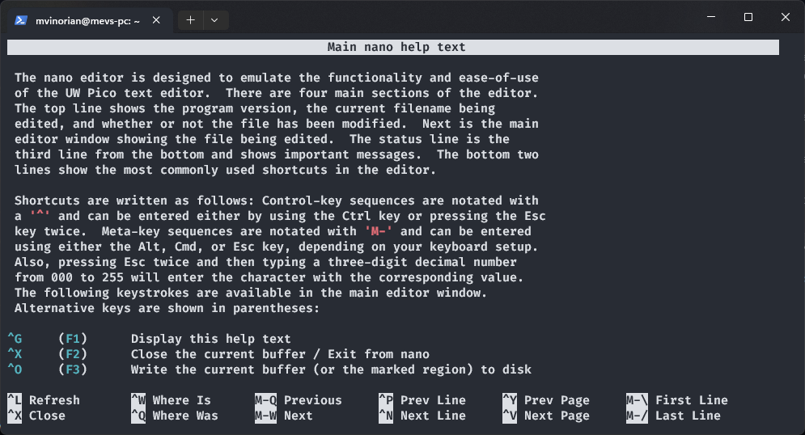

Untuk keluar dari tampilan bantuan, dapat menggunakan tombol `Q`. Setelah mengubah isi dari file yang ingin diubah, file dapat disimpan menggunakan shortcut `Ctrl + O`.

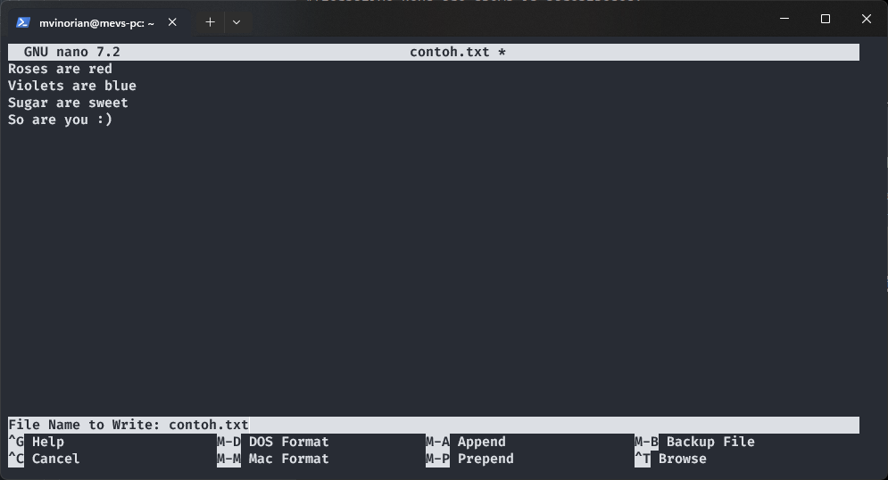

Kemudian akan muncul pertanyaan `File Name to Write: ` yang dapat diisi nama hasil file yang ingin disimpan. Setelah itu dapat ditekan `Enter`.

Ketika ingin keluar dari text editor secara langsung tanpa menyimpan file, dapat menggunakan shortcut `Ctrl + X`. Tekan `N` jika tidak ingin menyimpan perubahan atau `Y` untuk menyimpan perubahannya.


### Vim

Vim merupakan salah satu text editor yang mempunyai fitur lengkap untuk melakukan pengeditan pada file. Namun, text editor ini memiliki tampilan dan shortcut yang cukup rumit untuk dimengerti bagi pemula.

Untuk membuka file menggunakan vim, dapat menggunakan perintah berikut.

```sh
vim [nama-file]
```

Jika tidak bisa menggunakan perintah tersebut, berarti `vim` belum terinstall. Untuk melakukan instalasi `vim` dapat menggunakan perintah berikut.

```sh
sudo apt update
sudo apt install vim -y
```

Pada contoh kali ini akan digunakan untuk mengedit file `contoh.py`.

```sh
vim contoh.py
```

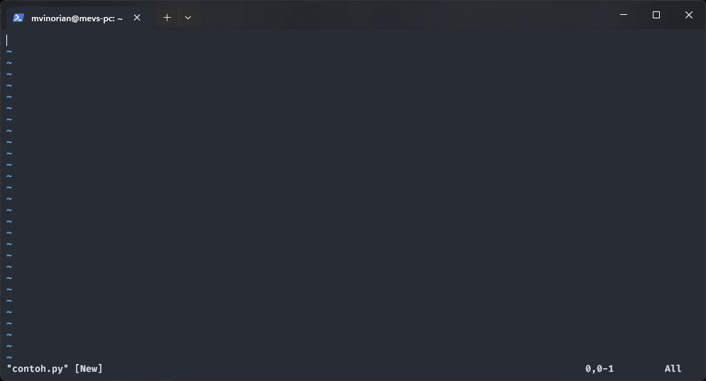

Pada tampilan awal, vim akan memasuki mode `normal`. Untuk masuk ke mode `insert`, dapat dilakukan dengan menekan tombol `i`. Dalam mode `insert`, dapat dilakukan penulisan karakter atau teks. Untuk kembali ke mode `normal`, dapat dilakukan dengan menekan tombol `Esc`.

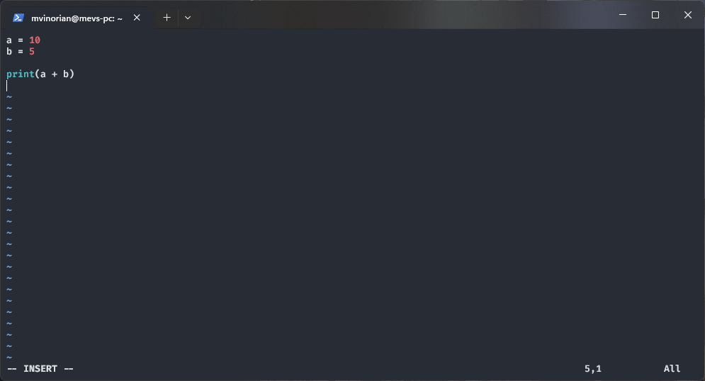

Dalam mode `normal`, kursor dapat digerakkan menggunakan tombol `h` untuk ke kiri, `j` untuk ke bawah, `k` untuk ke atas, dan `l` untuk ke kanan.

Untuk melakukan undo dapat dilakukan dengan menekan `u` pada mode `normal` atau `Alt + U` pada mode `insert`. Sedangkan untuk melakukan redo dapat dilakukan dengan menekan `Ctrl + R` pada mode `normal`

Untuk menyimpan file yang telah diedit, dapat mengetikkan `:w` pada mode `normal`. Atau jika ingin keluar setelah menyimpan file, dapat mengetikkan `:wq` pada mode `normal`. Namun jika ingin keluar tanpa menyimpan perubahan, dapat dilakukan dengan mengetikkan `:q!` pada mode `normal`.

Eksplorasi lebih lanjut dari text editor vim dapat dilakukan dengan mengakses tutorial vim dari terminal dengan perintah berikut.

```sh
vimtutor
```

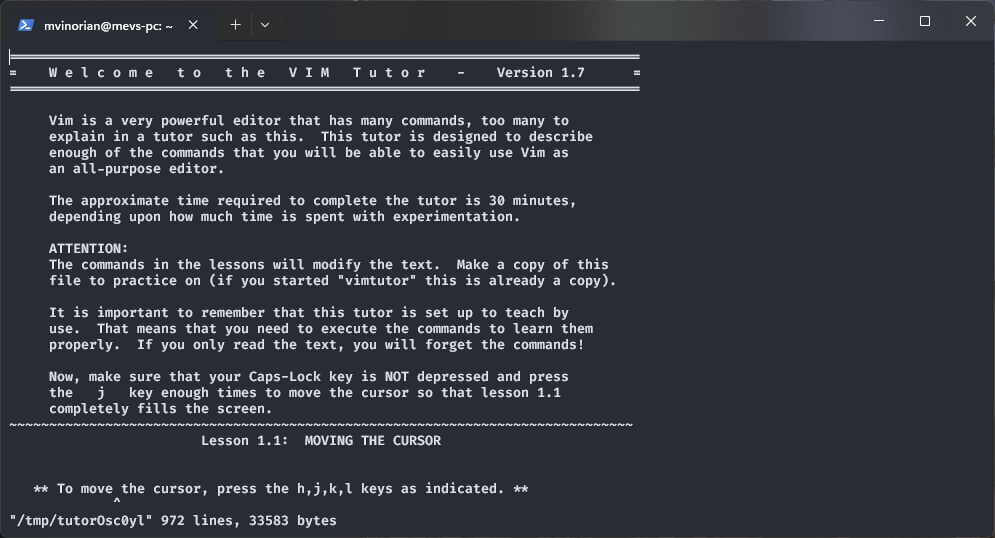

## Shell Scripting

Shell scripting atau pemrograman shell adalah penyusunan beberapa perintah shell menjadi satu file yang melakukan serangkaian tugas tertentu. Pemrograman shell pada linux mirip dengan bahasa pemrograman yang berbasis intrepeter lainnya seperti python dan javascript.

### Operasi Dasar Shell

Berikut adalah beberapa operasi dasar pada shell.

#### Redirection

Terdapat beberapa macam redirection pada shell sebagai berikut.

- Isi dari file b akan diganti dengan output perintah a dengan operasi `a > b`

  ```sh
  ls -l > dir.txt
  # hasil output ls -l akan dikirim ke file dir.txt
  # akan membuat file dir.txt jika belum ada
  ```

- Output dari perintah a ditambahkan ke file b dengan operasi `a >> b`

  ```sh
  ls -la >> dir.txt
  # hasil output dari ls -la akan ditambahkan pada akhir file dir.txt
  ```

- Input dari perintah a adalah file b dengan operasi `a < b`

  ```sh
  sort < dir.txt
  # input dari sort merupakan file dir.txt
  ```

- Isi dari file b akan diganti dengan error dari perintah a dengan operasi `a 2> b`

  ```sh
  rm testfile.txt 2> error.log
  # error dari perintah tersebut akan dikirim ke file error.log
  # akan membuat file error.log jika belum ada
  ```

- Error dari perintah a ditambahkan ke file b dengan operasi `a 2>> b`

  ```sh
  rm anotherfile.txt 2>> error.log
  # error dari perintah tersebut akan ditambahkan pada akhir file error.log
  ```

#### Pipe

Output dari perintah a dapat dijadikan input perintah b menggunakan operator pipe `a | b`.

```sh
ls -l | sort | head -5
# output dari ls -l akan dijadikan input dari sort
# output dari sort akan dijadikan input dari head -5
# output dari head -5 akan dikeluarakan di terminal
```

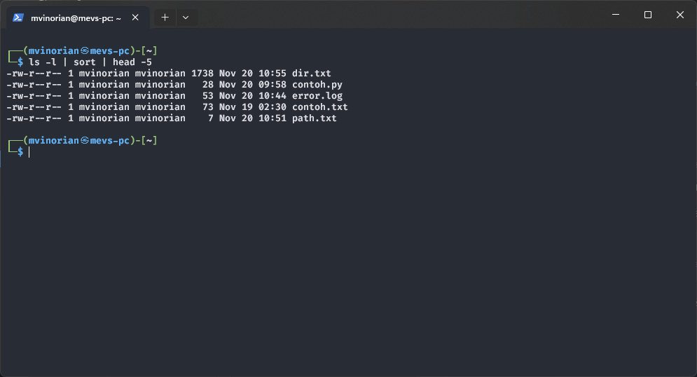

#### Wildcard

Perintah dalam shell juga dapat menggunakan wildcard atau karakter sembarang yang dapat mengisi string. Berikut adalah jenis-jenis dari wildcard yang bisa digunakan dalam shell.

- Untuk menggantikan semua string dapat menggunakan `*`

  ```sh
  ls *.txt
  # akan menampilkan list file dengan ekstensi .txt
  ```

- Untuk menggantikan satu huruf saja dapat menggunakan `?`

  ```sh
  ls a?a.txt
  # akan menampilkan list file dengan nama file awal a
  # kemudian huruf sembarang dan selanjutnya huruf a
  ```

- Untuk menggantikan satu huruf dengan huruf tertentu saja dapat menggunakan `[]`

  ```sh
  ls a[dp]a.txt
  # akan menampilkan list file dengan nama file awal a
  # kemudian huruf d atau p dan selanjutnya huruf a
  ```

  ```sh
  ls a[p-s].txt
  # akan menampilkan list file dengan nama file awal a
  # kemudian huruf antara p hingga s selanjutnya huruf a
  ```

Berikut adalah hasil dari perintah dengan wildcard di atas.

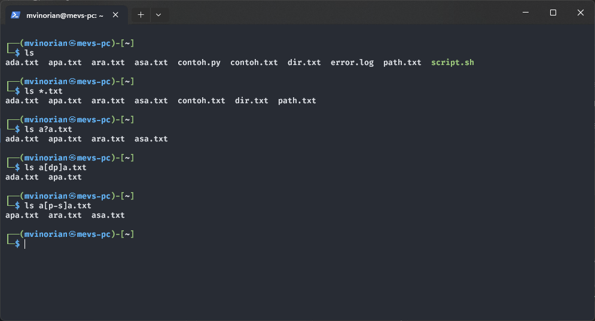

Agar mendapatkan hasil yang sama dapat menggunakan perintah berikut untuk membuat file dengan nama-nama seperti di atas.

```sh
touch apa.txt ada.txt ara.txt asa.txt
```

### Shell Script Sederhana

Untuk membuat shell script sederhana, dapat dilakukan dengan membuat file dengan ekstensi `.sh`.

```sh
nano hello.sh
```

Di dalam script `hello.sh` dapat dituliskan beberapa perintah shell. Namun sebelum itu, pada baris paling awal ditulis shebang `#!/bin/bash`.

Shebang berguna agar sistem mengetahui bahwa file `hello.sh` harus dijalankan oleh `/bin/bash` atau program bash. Karena file yang dibuat memiliki ekstensi `.sh`, jadi penggunaan shebang tidak terlalu berpengaruh. Jika file yang dibuat tidak memiliki ekstension apapun, maka perlu ditambahkan shebang pada baris paling awal.

```sh
#!/bin/bash

echo "Hello, world!"
```

Simpan perubahan pada file dan ubah permission dari file tersebut agar bisa dieksekusi.

```sh
chmod +x hello.sh
```

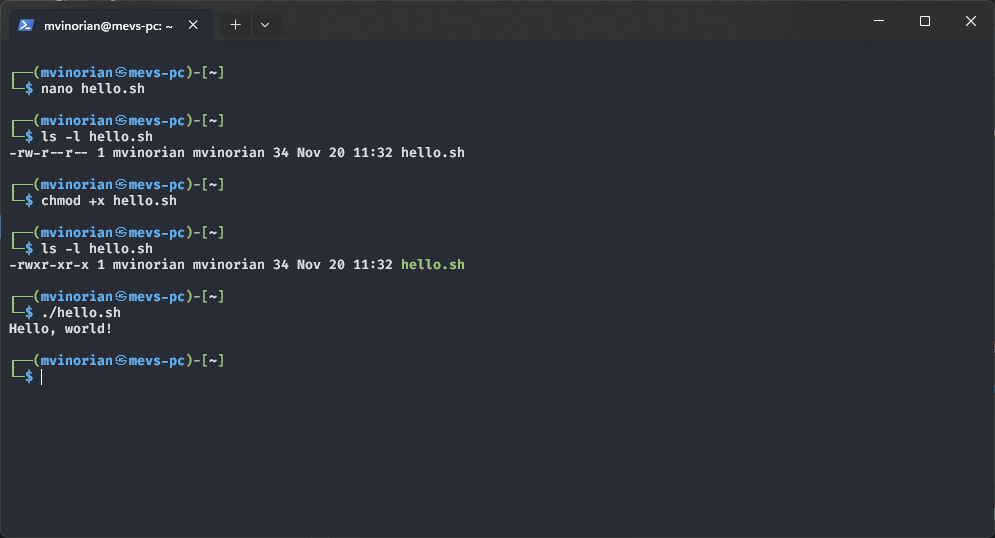

### Variabel

Sama seperti bahasa pemrograman lainnya, pada shell juga terdapat variabel. Terdapat beberapa hal yang perlu diperhatikan ketika mendefinisikan variabel.

- Nama variabel hanya boleh berisi dari karakter berikut
  - Huruf (a-z dan A-Z)
  - Angka (0-9)
  - Karakter underscore (-)
- Nama variabel dimulai dengan huruf atau underscore
- Bersifat case sensitive (huruf besar dan huruf kecil beda)

Mendeklarasikan variabel dapat dilakukan dengan operator `=`.

```sh
nama_var=nilai
```

Perlu diperhatikan bahwa tidak boleh terdapat spasi di antara `nama_var` dengan `=` dan juga `=` dengan `nilai`. Karena pada shell karakter spasi tidak diabaikan seperti bahasa pemrograman lainnya.

Untuk mengakses variabel dapat menggunakan simbol `$` sebelum nama variabel seperti berikut.

```sh
$nama_var
```

Variabel dalam shell tidak strongly typed, artinya tidak perlu dispesifikasikan tipe data variabel-nya. Berikut adalah beberapa deklarasi variabel dengan tipe datanya.

- String

  ```sh
  str1="ini string"
  str2='ini juga string'
  ```

- Number

  ```sh
  num1=19
  num2=12.5
  ```

- Array

  ```sh
  arr1=('satu' 'dua' 'tiga')
  arr2=(1 2 3)
  arr3=('satu' 2 'tiga')
  ```

  Akses variabel array dapat dilakukan dengan menggunakan sintaks berikut.

  ```sh
  ${arr1[0]} # mengakses arr1 indeks ke 0
  ${arr2[*]} # menampilkan semua elemen dari arr2
  ${#arr3[*]} # mengakses jumlah elemen dari arr3
  ```

Berikut adalah contoh penggunaan variabel dan juga keluarannya.

```sh
#!/bin/bash

str1="ini string"
str2='ini juga string'

echo $str1
echo $str2

num1=19
num2=12.5

echo $num1
echo $num2

arr1=('satu' 'dua' 'tiga')
arr2=(1 2 3)
arr3=('satu' 2 'tiga')

echo ${arr1[0]}
echo ${arr2[*]}
echo ${#arr3[*]}
```

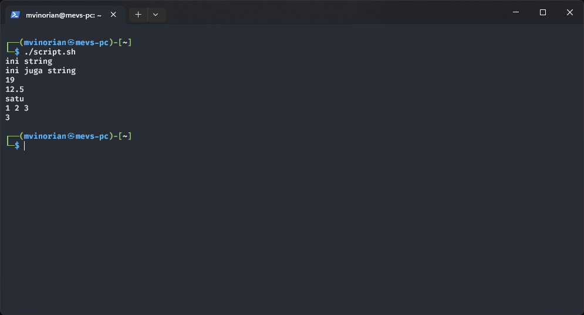

Terdapat variabel spesial dalam shell. Variabel berikut dapat diakses tanpa perlu dideklarasikan terlebih dahulu.

| Variabel | Deskripsi                                          |
| :------: | :------------------------------------------------- |
|    $0    | Berisi nama file yang sedang dijalankan            |
|    $n    | Berisi argumen ke-n dari pemanggilan script        |
|    $#    | Jumlah argumen dari pemanggilan script             |
|   $\*    | Berisi semua argumen dari pemanggilan script       |
|    $?    | Status exit dari perintah terakhir yang dijalankan |
|    $$    | Proses ID (PID) dari shell saat ini                |

Berikut adalah contoh penggunaan variabel tersebut dan juga keluarannya.

```sh
#!/bin/bash

echo "Nama script : $0"
echo "Argumen ke-1 : $1"
echo "Argumen ke-2 : $2"
echo "Hai $1, selamat datang di kelas $2!"
echo "Total argumen : $#"
echo "Semua argumen : $*"
echo "PID : $$"
```

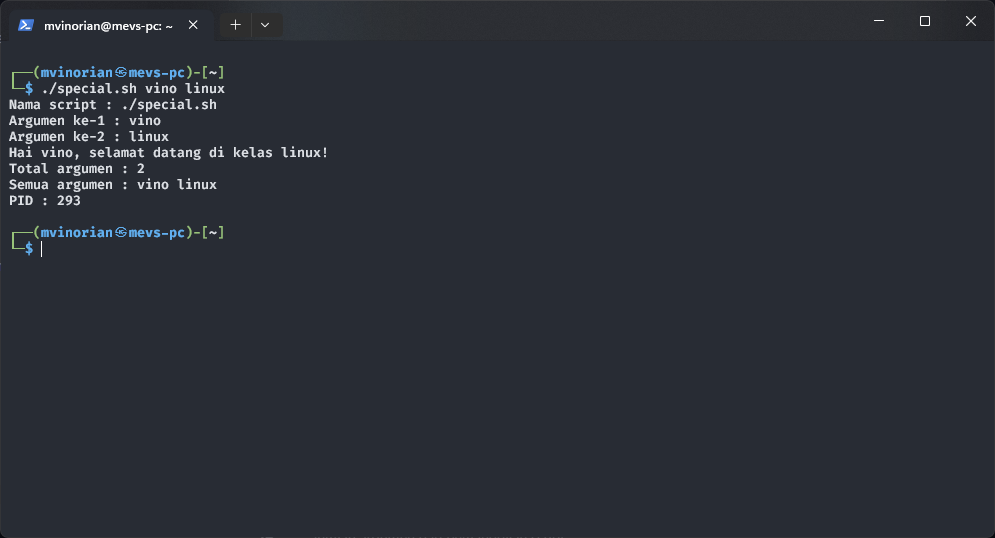

### Input dan Output

Untuk melakukan input dapat menggunakan perintah `read` dengan sintaks berikut.

```sh
read nama_var
```

Untuk melakukan output dapat menggunakan perintah `echo` dengan sintaks berikut.

```sh
echo $nama_var
```

Berikut adalah contoh penggunaan `read` dan `echo` beserta keluarannya.

```sh
#!/bin/bash

kelas='linux'

echo 'Siapa namamu?'
read nama
echo -e "Halo $nama!\nSelamat datang di kelas $kelas!\n"
```

Agar echo dapat merender `\n` sebagai karakter new line, perlu ditambahkan argumen `-e`.

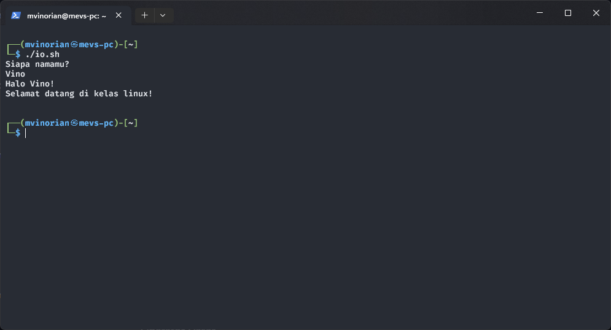

Selain menggunakan `echo`, output dalam shell juga dapat menggunakan `printf` seperti pada bahasa C.

```sh
#!/bin/bash

str='Ini string'
num1=12.956
num2=512

printf "str: %s\n" "$str"
printf "num1: %.2f\n" $num1
printf "num2: %d\n" $num2
```

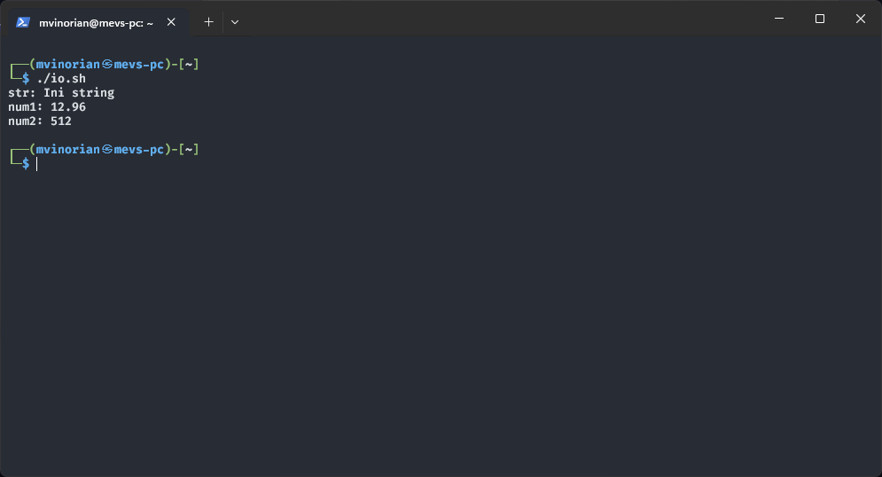

### Quoting

Terdapat beberapa metode quoting dan escaping dalam shell sebagai berikut.

| Quoting            | Deskripsi                                                                                        |
| ------------------ | ------------------------------------------------------------------------------------------------ |
| Single quote (`'`) | Semua karakter di dalam single quote akan dianggap sebagai string                                |
| Double quote (`"`) | Karakter `$`, `` ` ``, dan `\` dalam double quote dapat digunakan sebagaimana fungsinya di shell |
| Backslash (`\`)    | Karakter yang didahului backslash akan dianggap sebagai string                                   |
| Backtick (`` ` ``) | Perintah yang diletakkan dalam backtick akan dijalankan                                          |

Berikut adalah contoh penggunaan quoting dan juga keluarannya.

```sh
str='ini string'

echo '$str = "$str"'
echo "\$str = $str"
echo "pwd = `pwd`"
```

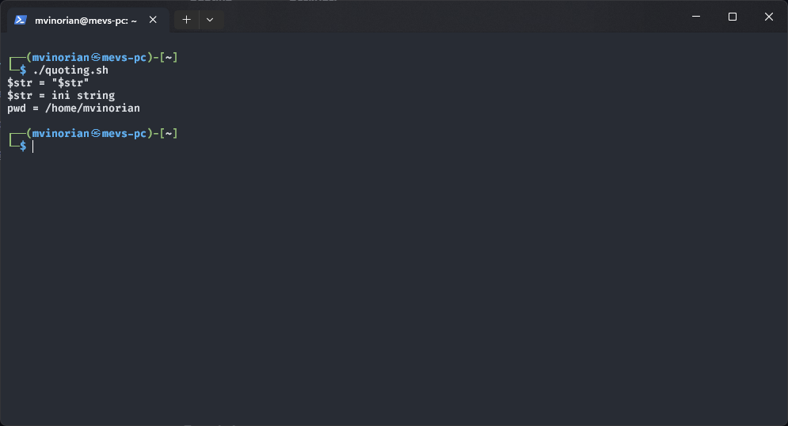

### Operator

Berikut adalah beberapa operator yang dapat dijalankan dalam shell.

#### Operator Aritmatika

| Operator | Deskripsi      |
| -------- | -------------- |
| +        | Penjumlahan    |
| -        | Pengurangan    |
| \*       | Perkalian      |
| /        | Pembagian      |
| %        | Sisa pembagian |
| ++       | Increment      |
| --       | Decrement      |

Untuk melakukan operasi aritmatika dapat menggunakan sintaks `$((10 + 2))` atau dengan perintah `expr`.

```sh
a=10
b=4

echo "a + b = $(($a + $b))"
echo "a - b = $(($a - $b))"
echo "a * b = $(($a * $b))"
echo "a / b = $(($a / $b))"
echo "a % b = $(($a % $b))"
echo "++a = $((++a))"
echo "a++ = $((a++))"
echo "--b = $((--b))"
echo "b-- = $((b--))"
```

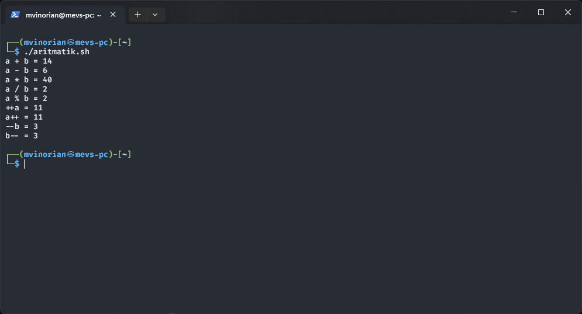

#### Operator Relasional

| Operator | Flag Ekuivalen | Deskripsi               |
| :------: | :------------: | ----------------------- |
|    ==    |      -eq       | Sama dengan             |
|    !=    |      -ne       | Tidak sama dengan       |
|    <     |      -lt       | Kurang dari             |
|    <=    |      -le       | Kurang dari sama dengan |
|    >     |      -gt       | Lebih dari              |
|    >=    |      -ge       | Lebih dari sama dengan  |

Operator relasional dapat digunakan dengan sintaks `$(( $a > $b ))` atau menggunakan sintaks `` `[[ $a -gt $b ]]` `` jika dengan flag.

```sh
#!/bin/bash

a=10
b=4

echo "a == b : $(($a == $b))"
echo "a != b : `[[ $a -ne $b ]] && echo '1' || echo '0'`"
echo "a < b : $(($a < $b))"
echo "a <= b : `[[ $a -le $b ]] && echo '1' || echo '0'`"
echo "a > b : $(($a > $b))"
echo "a >= b : `[[ $a -ge $b ]] && echo '1' || echo '0'`"
```

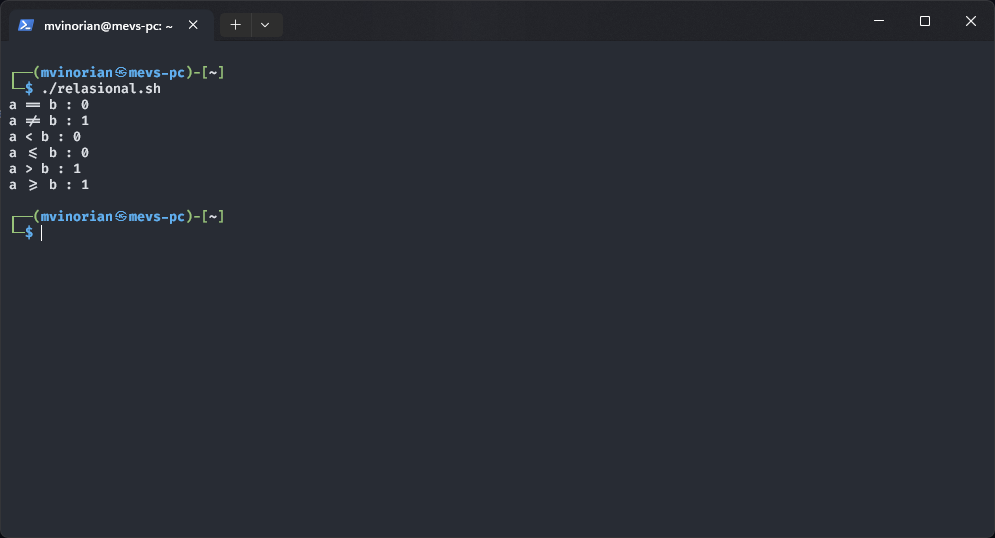

#### Operator Logika

| Operator | Deskripsi  |
| -------- | ---------- |
| &&       | Logika AND |
| \|\|     | Logika OR  |
| !        | Logika NOT |

Operator logika digunakan untuk menggabungkan dua atau lebih operator relasional.

### Percabangan

Dalam shell juga terdapat percabangan seperti pada bahasa pemrograman lainnya.

Berikut adalah contoh percabangan dalam shell dan keluarannya.

```sh
#!/bin/bash

a=10
b=10

if [[ $a -gt $b ]]
then
  echo 'a > b'
elif [[ $a -lt $b ]]
then
  echo 'a < b'
else
  echo 'a == b'
fi
```

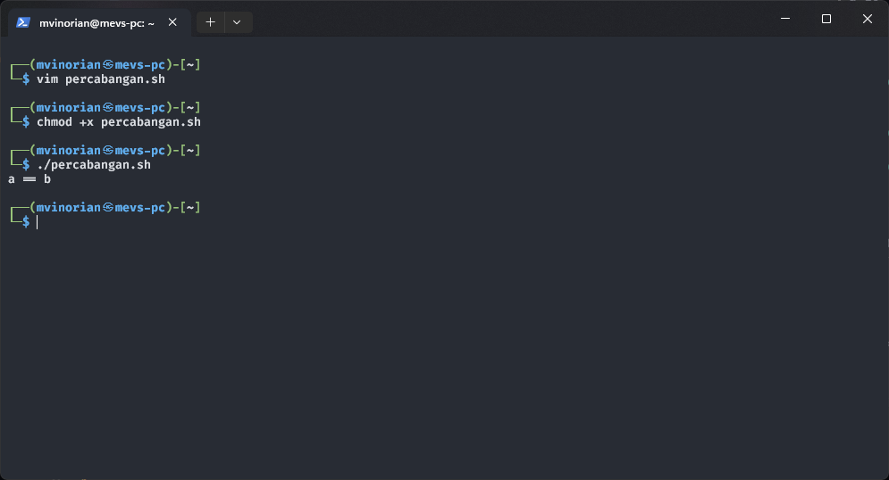

### Perulangan

Berikut adalah beberapa macam perulangan yang dapat digunakan dalam shell.

#### Perulangan While

Untuk menggunakan perulangan while dalam shell, dapat menggunakan contoh sintaks berikut.

```sh
#!/bin/bash

i=0

while [[ $i -lt 5 ]]
do
  echo $((i++))
done
```

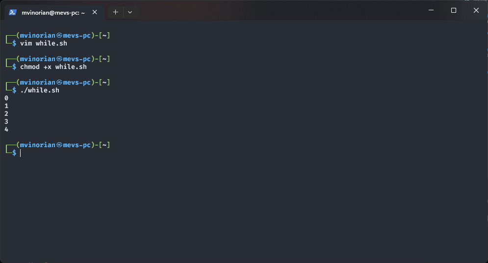

#### Perulangan For

Untuk menggunakan perulangan for dalam shell, dapat menggunakan beberapa contoh sintaks berikut.

```sh
#!/bin/bash

for i in 1 2 3 4 5
do
  echo $i
done
```

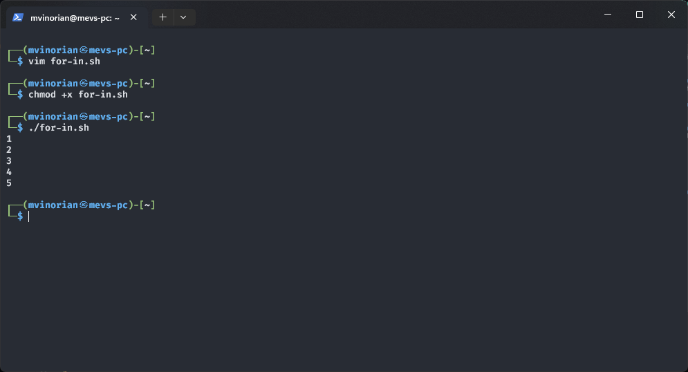

```sh
#!/bin/bash

for (( i = 0; i < 5; i++ ))
do
  echo $i
done
```

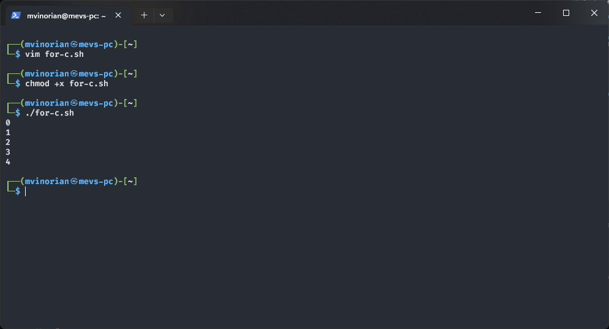

## Cronjob

### Apa itu Con Jobs?

Cron jobs adalah sebuah proses yang dilaksanakan dalam background yang memungkinkan user dari Linux untuk menjalankan perintah atau shell script pada waktu tertentu secara otomatis. Perintah atau script yang dijalankan oleh cron merupakan cron jobs.

Untuk mengelola cron jobs dapat menggunakan perintah crontab berikut.

```sh
crontab [-u user] [-l | -r | -e] [-i]
```

Keterangan:

- `-u` untuk membuat crontab pada user tertentu
- `-l` untuk menampilkan isi file crontab
- `-r` untuk menghapus file crontab
- `-e` untuk mengubah atau membuat file crontab jika belum ada
- `-i` untuk memberikan konfirmasi sebelum menghapus file crontab

### Membuat atau Mengubah Cron Jobs

Untuk membuat atau mengubah cron jobs dapat dilakukan dengan membuka crontab menggunakan perintah berikut.

```sh
crontab -e
```

Berkut adalah isi dari crontab.

```
* * * * * perintah yang akan dijalankan
- - - - -
| | | | |
| | | | +- Hari    [0 -  6] (0 = Minggu)
| | | +--- Bulan   [1 - 12]
| | +----- Tanggal [1 - 31]
| +------- Jam     [0 - 23]
+--------- Menit   [0 - 59]
```

Untuk melihat daftar cron jobs pada crontab dapat menggunakan perintah berikut.

```sh
crontab -l
```

Berikut adalah contoh hasil crontab.

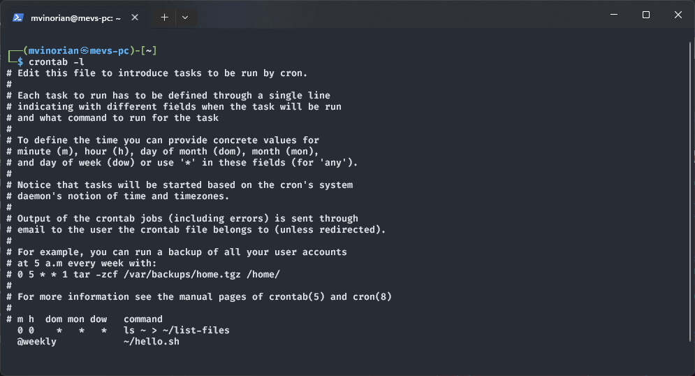

Cron job yang dimasukkan ke dalam crontab tersebut adalah untuk menjalankan perintah berikut.

- Setiap jam 0 dan menit 0 akan memasukkan hasil dari `ls ~` ke `~/list-files`
- Setiap minggu menjalankan `~/hello.sh`

Untuk referensi lebih lanjut mengenai perintah crontab dapat mengakses situs [crontab.guru](https://crontab.guru).
